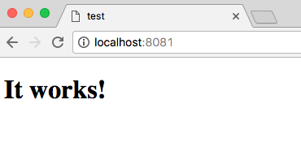
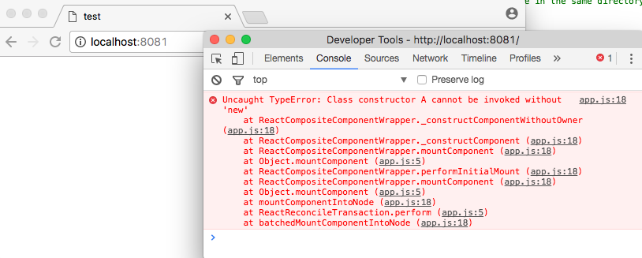

# Babili `simplify` and `deadcode` issue

[Babili has an issue](https://github.com/babel/babili/issues/393) where it accidencially removes class member assignments in certain cases when both `simplify` and `deadcode` plugins are enabled.

This repository is to provide minimal sample code to help reproduce the issue. There is another example using React to show the seriousness of this issue.

## Steps to reproduce
```sh
% git clone git@github.com:nodaguti/babili-simplify-and-deadcode-issue.git
% cd babili-simplify-and-deadcode-issue
% yarn install  # or `npm install`
% yarn run minimum  # The minimum sample code
% yarn run react  # The sample React application
```

## Minimum code
### Expected Result
```
$ node lib/minimum-none.js
aaa
bbb
ccc
$ node lib/minimum-deadcode.js
aaa
bbb
ccc
$ node lib/minimum-simplify.js
aaa
bbb
ccc
$ node lib/minimum-both.js
aaa
bbb
ccc
```

### Actual Result
```
$ node lib/minimum-none.js
aaa
bbb
ccc
$ node lib/minimum-deadcode.js
aaa
bbb
ccc
$ node lib/minimum-simplify.js
aaa
bbb
ccc
$ node lib/minimum-both.js
aaa
undefined
/Users/xxx/workspace/babili-simplify-and-deadcode-issue/lib/minimum-both.js:1
(function (exports, require, module, __filename, __dirname) { (function(modules){function __webpack_require__(moduleId){if(installedModules[moduleId])return installedModules[moduleId].exports;var module=installedModules[moduleId]={i:moduleId,l:false,exports:{}};return modules[moduleId].call(module.exports,module,module.exports,__webpack_require__),module.l=true,module.exports}var installedModules={};return __webpack_require__.m=modules,__webpack_require__.c=installedModules,__webpack_require__.i=function(value){return value},__webpack_require__.d=function(exports,name,getter){__webpack_require__.o(exports,name)||Object.defineProperty(exports,name,{configurable:false,enumerable:true,get:getter})},__webpack_require__.n=function(module){var getter=module&&module.__esModule?function(){return module['default']}:function(){return module};return __webpack_require__.d(getter,'a',getter),getter},__webpack_require__.o=function(o

TypeError: a.ccc is not a function
    at Object.<anonymous> (/Users/xxx/workspace/babili-simplify-and-deadcode-issue/lib/minimum-both.js:1:1554)
    at __webpack_require__ (/Users/xxx/workspace/babili-simplify-and-deadcode-issue/lib/minimum-both.js:1:288)
    at module.exports (/Users/xxx/workspace/babili-simplify-and-deadcode-issue/lib/minimum-both.js:1:1036)
    at Object.<anonymous> (/Users/xxx/workspace/babili-simplify-and-deadcode-issue/lib/minimum-both.js:1:1082)
    at Module._compile (module.js:571:32)
    at Object.Module._extensions..js (module.js:580:10)
    at Module.load (module.js:488:32)
    at tryModuleLoad (module.js:447:12)
    at Function.Module._load (module.js:439:3)
    at Module.runMain (module.js:605:10)
```

### Why broken?
The original code involved is

```
function A(){
  this.aaa = 'aaa';
}

A.prototype.bbb = 'bbb';
A.prototype.ccc = () => 'ccc';

if (process.env.NODE_ENV !== 'production') {
  var ddd = 'ddd';
}
```
which is a ES5-style class definition (src/minimum/A.js).

With `process.env.NODE_ENV` being `production`, `simplify` changes the code into
```
function A(){
  this.aaa = 'aaa'
}
if (A.prototype.bbb='bbb', A.prototype.ccc=()=>'ccc', false)
  var ddd = 'ddd';
```
(Added whitespace for readability)

and `deadcode` removes the `if` block, wiping `A#bbb` and `A#ccc` out.

You can also reproduce the issue on [Babel repl](http://babeljs.io/repl/#?babili=true&evaluate=false&lineWrap=false&presets=&code=function%20A()%7B%0A%20%20this.aaa%20%3D%20'aaa'%3B%0A%7D%0A%0AA.prototype.bbb%20%3D%20'bbb'%3B%0AA.prototype.ccc%20%3D%20()%20%3D%3E%20'ccc'%3B%0A%0A%2F%2F%20process.env.NODE_ENV%20!%3D%3D%20'production'%20where%20NODE_ENV%3Dproduction%0Aif%20('production'%20!%3D%3D%20'production')%20%7B%0A%20%20var%20ddd%20%3D%20'ddd'%3B%0A%7D%0A%0Aconst%20a%20%3D%20new%20A()%3B%0Aconsole.log(a.aaa)%3B%0Aconsole.log(a.bbb)%3B%0Aconsole.log(a.ccc)%3B).


## React
### Expected Result


### Actual Result


### Why broken?
With the same mechanism mentioned above, `simplify` and `deadcode` eliminate `ReactComponent#isReactComponent` ([ReactComponent.js#L33](https://github.com/facebook/react/blob/master/src/isomorphic/modern/class/ReactComponent.js#L33)), which causes `shouldConstruct()` ([ReactCompositeComponent.js#L46](https://github.com/facebook/react/blob/master/src/renderers/shared/stack/reconciler/ReactCompositeComponent.js#L46)) to return `false`, which finally leads to call each React component's constructor without `new` ([ReactCompositeComponent#L416](https://github.com/facebook/react/blob/master/src/renderers/shared/stack/reconciler/ReactCompositeComponent.js#L416)).

This is a serious problem since it prevents any user-defined React components from working.
